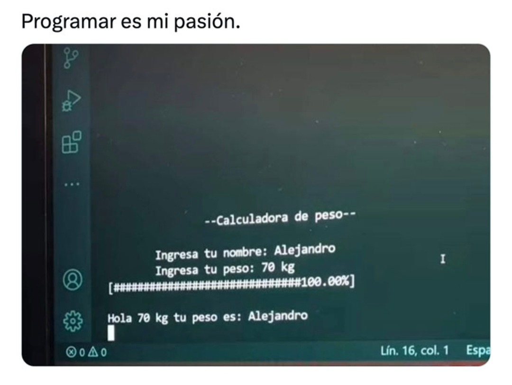

+++
title = "My First “Hello World”… on an HP 50G"
date = 2016-12-10
+++

## 1. THIRD TIME FAILURE? 

Back in university, I had this legendary course called "Programación de Obras" — or whatever heroic name you’d give a class where diagrams must be so exact that even NASA would say: “bro, relax.”

It was my third time taking the course (yes, third… don’t judge), because I always missed a couple of points here and there. Precision wasn’t exactly my superpower back then.

But this time, I had a secret weapon my HP 50G calculator, capable of running tiny programs like a pocket-sized computer from the future (or from 1995, same thing).

So I watched some YouTube videos and then I connected my calculator to my computer and coded my first mini-program ever.

## 2. THE EXAM DAY PLOT TWIST

The exam was brutal. Everyone looked like their soul was leaving their body. (not really only me XD)

There was a very smart girl in the class, (we’ll call her K to protect her genius identity). The teacher gave her a 12, and I thought:

“Well… if she got a 12, I’m done. GG. See you next semester… again.”

But suddenly, the teacher called me.
He reviewed my exam in front of me, corrected each part, and everything I had programmed in the HP 50G was right. Completely, perfectly right.

I walked out with a 17. People looked at me like I had hacked the matrix.

But nope — it was just me and my nerdy calculator.

That day, I passed my last university course, and my love story with programming officially began.
