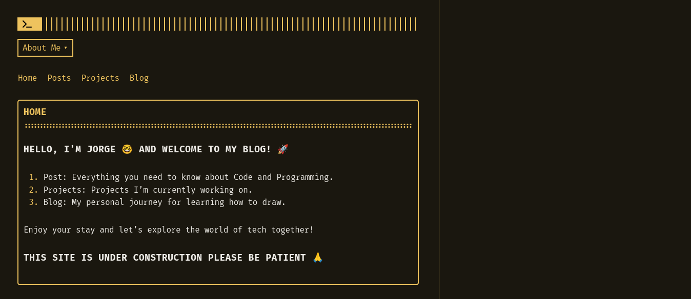
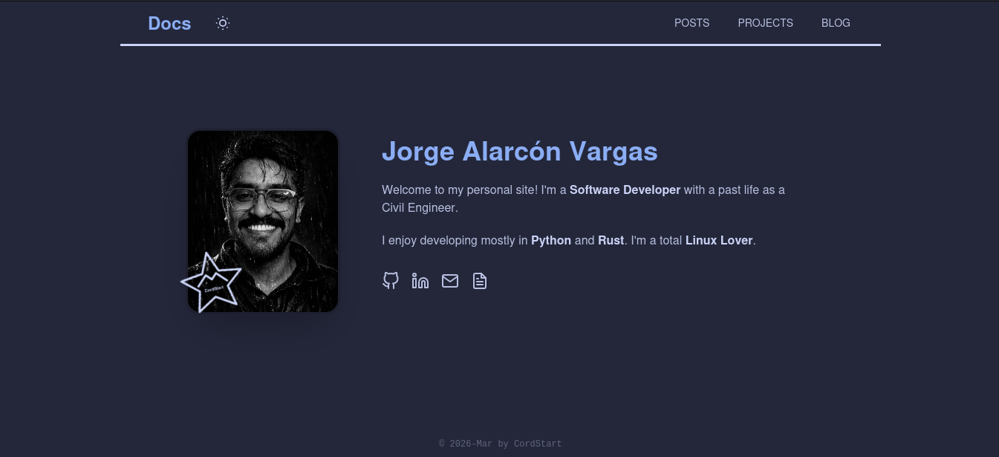

+++
title = "Hugo vs Zola"
date = 2026-03-10
description = "Building a portfolio with Hugo or Zola represents the 'modern classic' approach to using Static Site Generators (SSGs) to create simple but powerful applications. This allows us to achieve incredible speed and developer control. We are going to explore the architecture, features, simplicity, and the results that can be achieved."
+++

1. Hugo: The Powerhouse of Golang
- Hugo is built in Go and is famous for being the fastest SSG in existence. It is ideal for large portfolios or sites that might eventually grow into hundreds of pages.

- Strengths: Massive theme ecosystem, extremely fast build times, and advanced features like Image Processing (resizing/optimizing images automatically).

- Complexity: The learning curve is steeper due to "Hugo Pipes" and its unique templating syntax.

2. Zola: The Rust Elegant Alternative

- Zola is a "single-binary" generator written in Rust. It is often preferred by developers who want everything built-in without managing external plugins.

- Strengths: It includes Sass compilation, Image processing, and Search indexing out of the box. The Tera templating engine is very similar to Jinja2 or Twig, making it intuitive for Python or PHP developers.

- Simplicity: It uses a flat, easy-to-understand directory structure.

